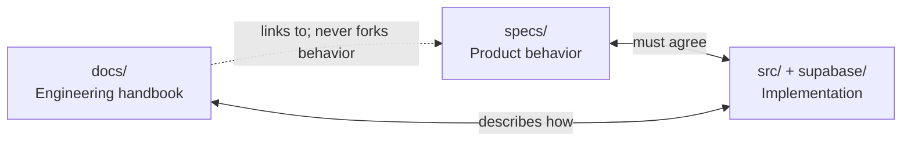

# Docs ↔ Specs ↔ Code sync

## Principle

**Three layers, one truth:**

- **Specs** own *what* users/staff experience.
- **Code** implements specs.
- **Docs** explain *architecture, sequences, ops* and **link** to specs — they must not invent contradictory product rules.

## When to update what

| Change type | Specs | Code | Docs |
|-------------|-------|------|------|
| User-visible behavior | ✅ first | ✅ | Update matching **flow** / diagram if sequence changes |
| New API route / table | ✅ `files` + database/feature | ✅ | Update **folder-map**, **data model**, relevant **flow** |
| Refactor only (same behavior) | Usually no | ✅ | Update paths in diagrams if structure moved |
| Debug tip / onboarding | no | no | ✅ docs only |
| Migration | `global.database` | ✅ SQL | `operations/migrations.md` + `data/model.md` if schema shape changed |

## Checklist (every PR that touches product)

- [ ] Spec updated (or confirmed N/A)
- [ ] Code matches acceptance criteria
- [ ] If a diagram in `docs/flows/*` or `docs/data/*` is now wrong → fix it in the same PR
- [ ] `specs` stamped after commit (`npm run specs:stamp`)
- [ ] Docs INDEX / README still accurate for new pages

## Cursor / AI

Always-on rules:

- [`.cursor/rules/spec-driven-development.mdc`](../../.cursor/rules/spec-driven-development.mdc) — specs first
- [`.cursor/rules/system-documentation.mdc`](../../.cursor/rules/system-documentation.mdc) — keep handbook diagrams current

Agents should treat `docs/INDEX.md` like `specs/INDEX.md`: find the owning doc before changing architecture narratives.

## Stale docs signal

If a sequence diagram names a route, table, or permission that no longer exists in code → **fix the diagram immediately**; do not leave “historical fiction” in the handbook.
