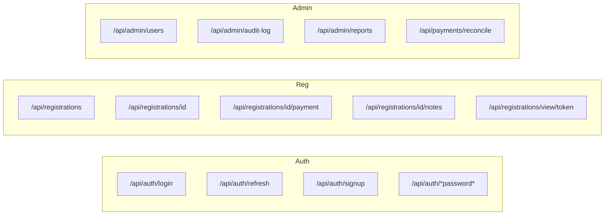

# Folder map — where to change what

## Repository tree

```
CFCA_Registration/
├── specs/                 # Product behavior (source of truth)
├── docs/                  # This handbook
├── src/
│   ├── app/               # Routes (pages + API)
│   ├── components/        # UI by feature
│   ├── hooks/
│   ├── lib/               # Domain logic
│   └── proxy.ts           # Auth gate for protected pages
├── supabase/migrations/   # Numbered SQL only
├── scripts/db/            # deploy runner
└── .cursor/rules/         # AI always-on rules
```

## Decision table

| If you need to change… | Start here | Spec |
|------------------------|------------|------|
| Registration form UI | `src/components/registrations/registration-form.tsx` | `features.registration` |
| Registration validation | `src/lib/registrations/schema.ts` | `features.registration` |
| Amount due / pricing | `src/lib/pricing/calculate.ts` + `service.computeAmountDue` | `features.registration` / payment |
| Souvenirs | `src/lib/registrations/souvenirs.ts` | `features.registration` |
| Guest vs auth submit API | `src/app/api/registrations/route.ts` | `features.registration` |
| Update registration / no-op | `src/app/api/registrations/[id]/route.ts`, `compare.ts` | `features.registration` |
| Login / cookies | `src/app/api/auth/*`, `src/lib/auth/*` | `global.auth-security`, `features.login` |
| Protected routes | `src/lib/auth/paths.ts`, `src/proxy.ts` | `global.layout-and-navigation` |
| Header Login/Register | `src/components/layout/site-header.tsx` | `global.layout-and-navigation` |
| Dashboard submenu | `src/components/layout/dashboard-subnav.tsx` + site header dropdown | `features.dashboard` / layout |
| User roles / groups | `src/app/dashboard/users/page.tsx`, `src/app/api/admin/users/route.ts`, `src/lib/auth/user-groups.ts` | `features.dashboard` |
| Payment page | `src/app/payment/page.tsx` | `features.payment` |
| Manual payment / notes | `src/app/api/registrations/[id]/payment`, `.../notes` | `features.dashboard` |
| Reconcile | `src/app/api/payments/reconcile/route.ts` | `features.dashboard` |
| Dashboard list/cache | `src/app/dashboard/page.tsx`, `src/lib/dashboard/*` | `features.dashboard` |
| Users / audit / reports cache | `users-list-cache.ts`, `audit-list-cache.ts`, `reports-cache.ts`, `list-cache.ts` | `features.dashboard` / `features.audit` |
| Detailed CSV export | `src/app/api/admin/reports/route.ts` | `features.dashboard` |
| Admin detail | `src/app/dashboard/registrations/[id]/page.tsx` | `features.dashboard` |
| Audit write / UI | `src/lib/audit/*`, `src/app/dashboard/audit` | `features.audit` |
| Email content | `src/lib/email/send.ts` | related feature + registration |
| Schema | `supabase/migrations/0xx_*.sql` | `global.database` |

## API surface (App Router)



## lib/ domains

| Folder | Responsibility |
|--------|----------------|
| `lib/auth` | JWT, cookies, session, permissions, paths |
| `lib/registrations` | Zod schema, DB mapping, tokens, compare, souvenirs |
| `lib/pricing` | Conference fee calculation |
| `lib/payments` | Bank PDF parse helpers |
| `lib/audit` | Sanitize + write audit rows |
| `lib/email` | Resend templates |
| `lib/dashboard` | Client list cache |
| `lib/db` | Migration helpers |
| `lib/supabase` | Admin client |

## Anti-patterns

- Editing an **already-applied** migration on shared envs — add `013_…sql` instead.
- Putting product rules only in docs — put them in **specs**.
- Calling Supabase from the browser with service role — never; APIs use admin client server-side.
