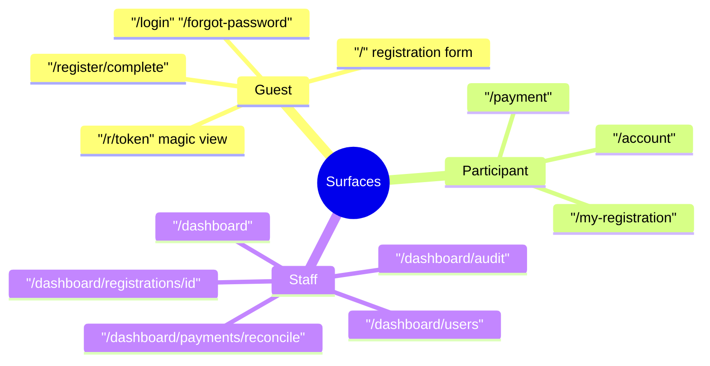
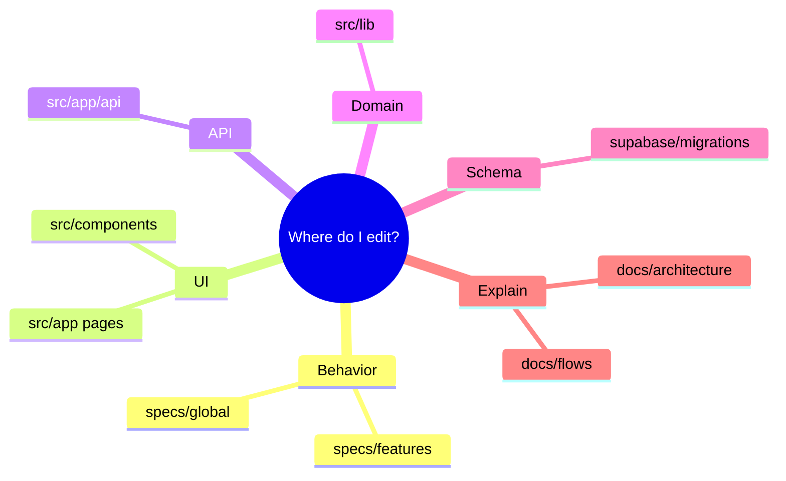
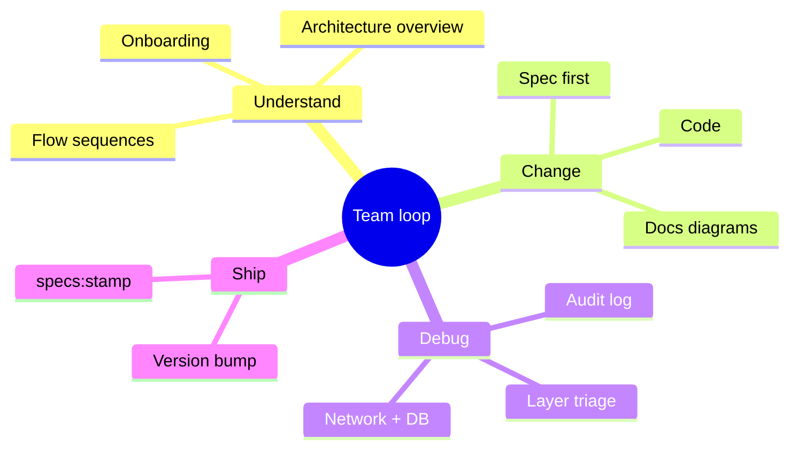

# System mind maps

Quick visual index. Detail lives in linked pages.

## Product surface

## Change ownership

## Maintain & enhance loop

## Deep links

| Topic | Doc |
|-------|-----|
| Context / containers | [architecture/overview.md](../architecture/overview.md) |
| Folders | [architecture/folder-map.md](../architecture/folder-map.md) |
| Auth / reg / pay / admin | [flows/](../flows/) |
| ER + data movement | [data/model.md](../data/model.md), [data/data-flow.md](../data/data-flow.md) |
| Add feature / fix bug | [contributing/](../contributing/) |
