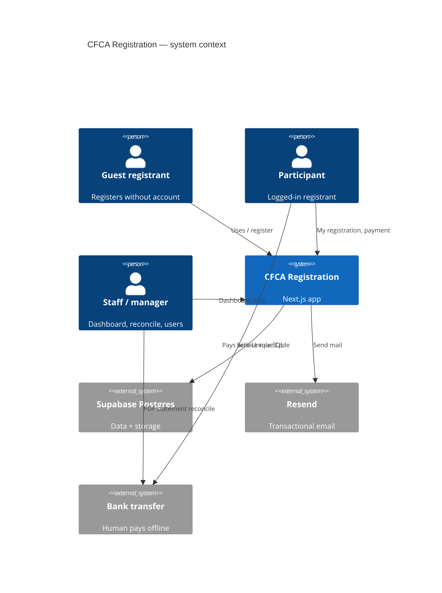
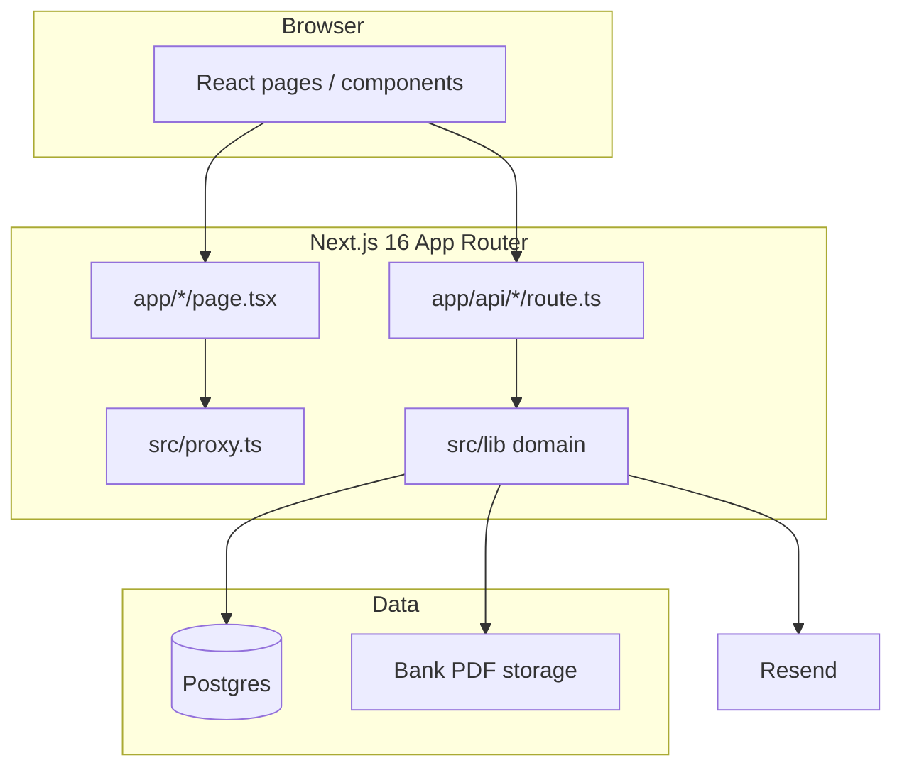
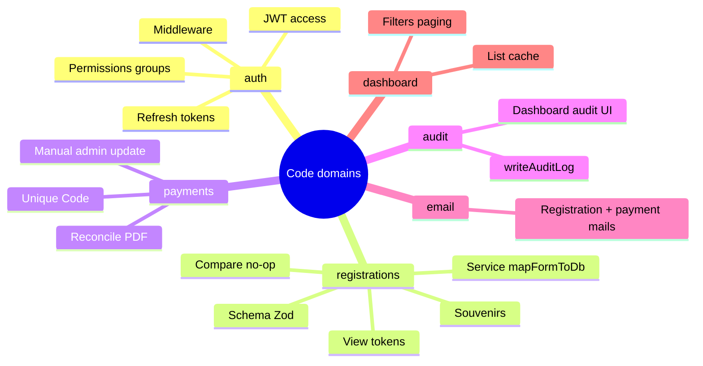
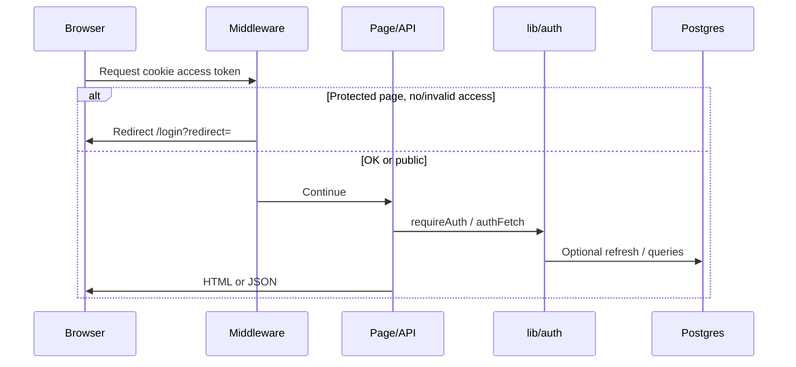

# Architecture overview

Linked specs: all of [`specs/INDEX.md`](../../specs/INDEX.md).

## System context

## Containers

## Domain mind map

## Request path (typical authenticated API)

## Design principles used here

1. **Spec-first** product changes (`specs/` then code).
2. **Authorization in API** (service-role Supabase; RLS disabled on app tables).
3. **Audit sensitive mutations** (`audit_log`).
4. **Unique Code** for payment matching (`participant_reference`).
5. **No-op saves skipped** (client + server) to avoid empty audits.

## Where to go next

- [folder-map.md](./folder-map.md) — find files fast  
- [tech-stack.md](./tech-stack.md) — runtime details  
- [../data/model.md](../data/model.md) — tables  
