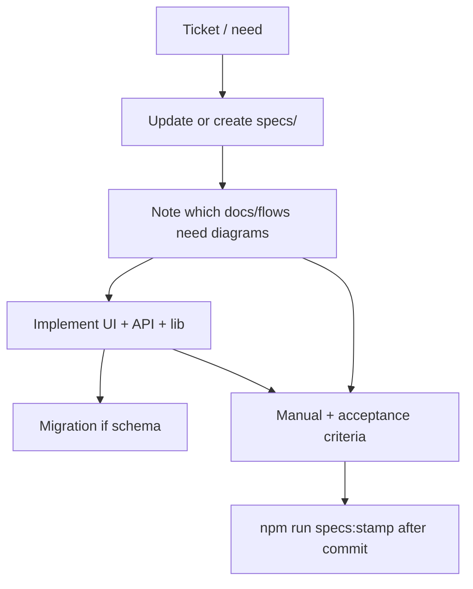

# Add a feature

Audience: junior implementing a ticket, or senior adding a cross-cutting capability.

## End-to-end workflow

## Steps (checklist)

1. **Find ownership** — [`specs/INDEX.md`](../../specs/INDEX.md) → open matching feature/global spec.
2. **Update the spec** — behavior, acceptance criteria, `files:` list. Use [`TEMPLATE.md`](../../specs/_meta/TEMPLATE.md) for brand-new features; add a row to INDEX.
3. **Plan code touchpoints** — [`folder-map.md`](../architecture/folder-map.md). Typical stack:
   - Page under `src/app/...`
   - API under `src/app/api/...`
   - Domain under `src/lib/...`
   - UI under `src/components/...`
4. **Schema?** — new numbered migration ([migrations.md](../operations/migrations.md)); update `global.database` + [data/model.md](../data/model.md).
5. **Implement**
   - Match acceptance criteria exactly.
   - Loading/disabled on every user-triggered async action (project front-end rule).
   - Permissions: check existing `requirePermission` / group patterns.
   - Audit meaningful mutations via `writeAuditLog`; skip no-ops.
6. **Update handbook** — if the sequence or architecture changed, edit the matching `docs/flows/*` or overview in the **same PR** ([SYNC-WITH-SPECS](../_meta/SYNC-WITH-SPECS.md)).
7. **Verify** — walk acceptance criteria as guest and as relevant role.
8. **Version** — bump `package.json` for functional changes (patch/minor per team rules).
9. **Commit** (when asked) → `npm run specs:stamp`.

## Where to put what

| Kind of change | Prefer |
|----------------|--------|
| New user-facing flow | New `specs/features/*.md` + pages/API |
| Shared auth/DB/theme | `specs/global/*` |
| Pure refactor | Code only; update docs paths if moved |
| Ops tip | `docs/operations/*` only |

## Junior tips

- Copy an existing similar feature (e.g. notes API) rather than inventing a new pattern.
- Keep business rules in `src/lib`, not only in React components.
- Ask: “Which spec owns this?” before writing code.

## Senior tips

- Prefer extending permissions over hard-coding role names in many places.
- Watch for guest vs authenticated paths on registration APIs.
- Keep diagrams honest; delete obsolete mermaid nodes rather than commenting “old”.
