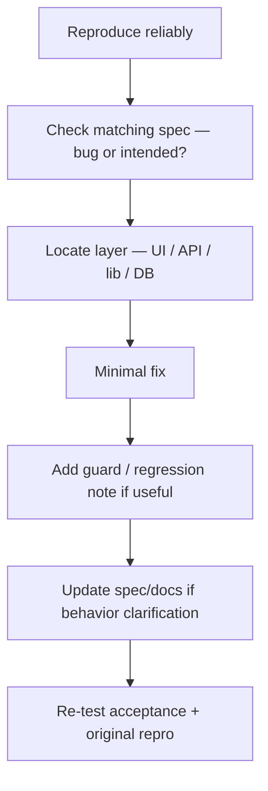

# Fix a bug

## Workflow

## 1. Reproduce

- Exact URL, role (guest / participant / which manager), browser.
- Note Network status codes and response JSON.
- Prefer a minimal data case (one registration, one payment).

## 2. Spec vs defect

| Finding | Action |
|---------|--------|
| Code ≠ active spec | Fix **code** to match spec |
| Spec wrong / outdated | Fix **spec** (and docs) then code if needed |
| Spec silent | Decide intended behavior with team; write it into spec before “fixing” |

## 3. Locate

Use [debugging.md](../operations/debugging.md). Common hotspots:

| Area | Files |
|------|-------|
| Auth | `src/lib/auth/*`, `src/proxy.ts`, `src/app/api/auth/*` |
| Registration | `registration-form.tsx`, `schema.ts`, `service.ts`, `api/registrations/*` |
| Payment | `payment/page.tsx`, `api/.../payment`, `api/payments/reconcile` |
| Dashboard | `dashboard/page.tsx`, list cache, detail page |

## 4. Fix

- Prefer the smallest change that restores acceptance criteria.
- Preserve loading/disabled interaction rules on buttons.
- If saves were writing empty audits, ensure no-op comparison runs on **both** client and server.
- Do not edit applied migrations; add a forward migration for schema bugs.

## 5. Verify

- Original failing case passes.
- Nearby happy path still works (e.g. real edits still audit).
- If you clarified product rules, update the feature spec + any stale sequence in `docs/flows/`.

## 6. Ship

- Functional fix → patch version bump.
- Commit when requested; stamp specs after commit.
