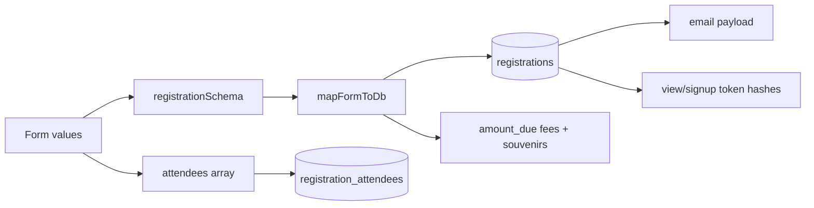
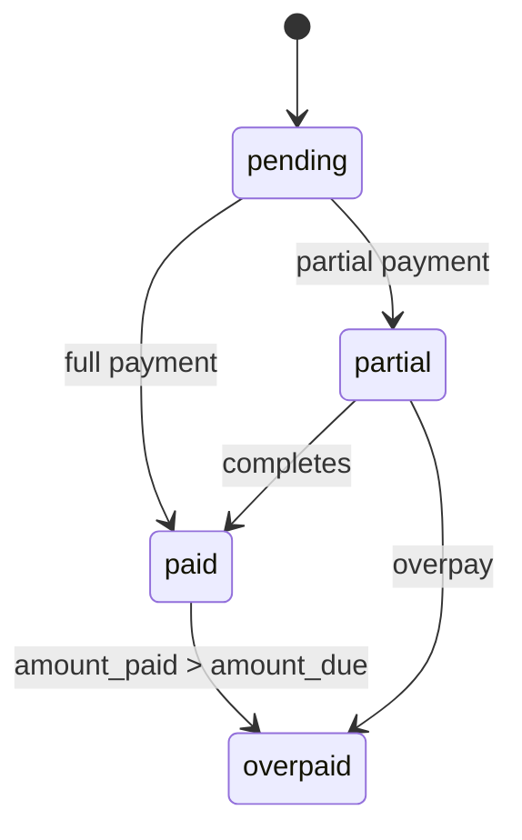
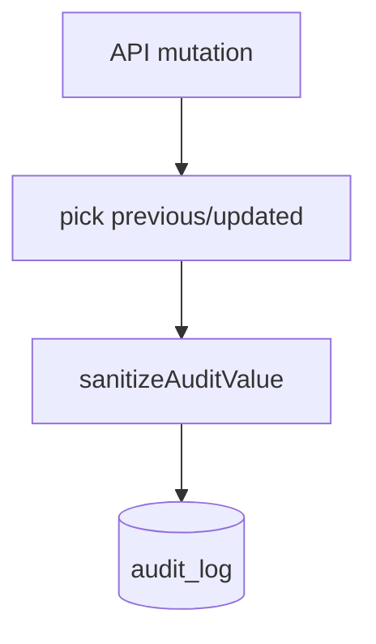
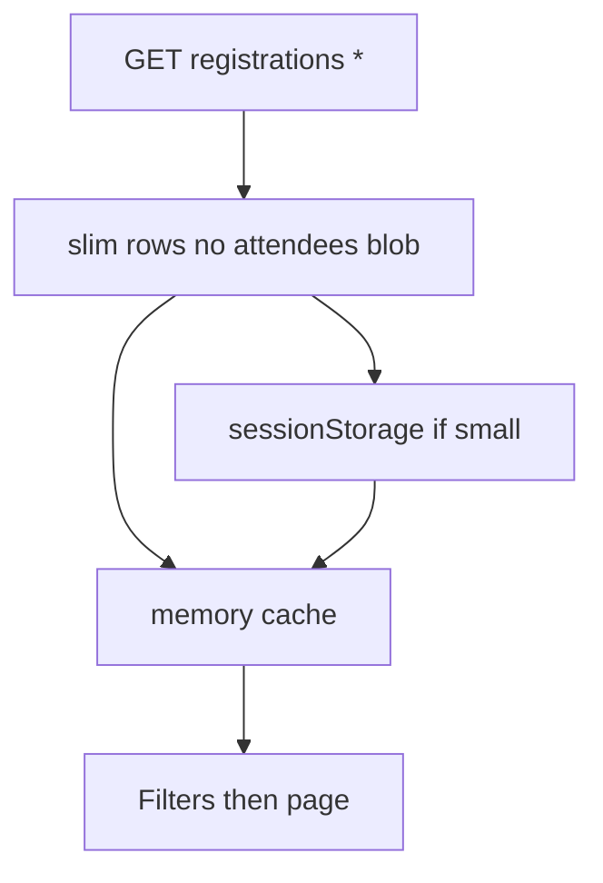

# Data flow

## Registration create (guest) — data movement

## Payment status lifecycle

Sources of truth updates: reconcile (`bank_reconcile`) or admin PATCH (`manual`).

## Audit data flow

Sensitive keys redacted (`password_hash`, tokens, etc.).

## Dashboard list cache flow

Cap / TTL: see `src/lib/dashboard/registrations-list-cache.ts`.
