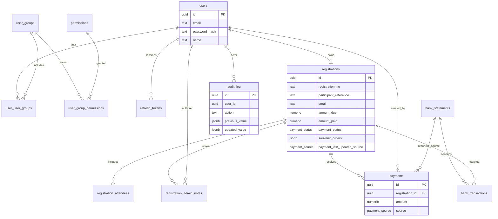

# Data model

Spec: `global.database`. Schema evolves only via numbered migrations in `supabase/migrations/`.

## Entity relationship (simplified)

## Important registration fields

| Field | Role |
|-------|------|
| `registration_no` | Display / alternate payment match |
| `participant_reference` | **Unique Code** for bank Message/Ref |
| `souvenir_orders` | `[{ size, quantity }, …]` t-shirts |
| `pickup_*` / `dropoff_*` | Transport flags + admin contacts |
| `hotel_name` / `hotel_address` | UI: Accommodation name/address |
| `view_token_hash` / signup tokens | Magic link + account link |

## Groups (seeded)

`admin`, `registration_manager`, `accommodation_manager`, `participant` — see `001_auth.sql`.

## When adding columns

1. New file `supabase/migrations/0xx_name.sql`
2. Update `specs/global/database.md`
3. Update this ER if relationships change
4. Update Zod / `mapFormToDb` / compare snapshots as needed
5. Never edit applied migrations on shared environments
