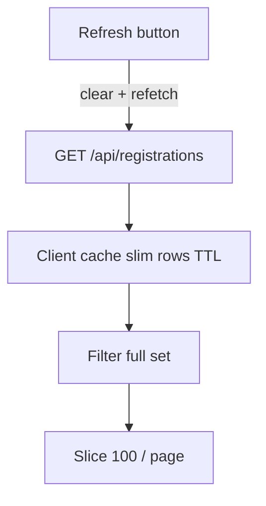
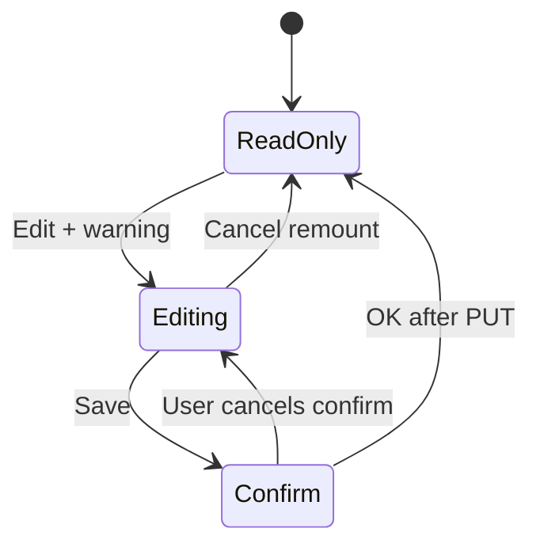

# Admin dashboard flows

Specs: `features.dashboard`, `features.audit`.

## List + filters + paging



Filters (full dataset): payment, accommodation, transpo, state, souvenir pre-order, text search.

## Registration detail



Sections: Registration Info → Payment → Attendees → Accommodation → Transportation → **Admin notes** (bottom).

## Audit log

```mermaid
flowchart LR
  Action[Mutation] --> Write[writeAuditLog]
  Write --> Table[(audit_log)]
  Table --> UI[/dashboard/audit]
```

Empty registration updates should **not** write rows (no-op guards).

## Permissions cheat sheet

| Capability | Typical permission |
|------------|-------------------|
| See dashboard | manager group |
| Edit all registration fields | `registrations:write_all` |
| Edit accommodation/transport | `accommodation:write_all` |
| Reconcile / manual payment | `payments:reconcile` (and/or write_all) |
| Users + audit UI | `users:manage` |

## Key files

- `src/app/dashboard/page.tsx`
- `src/lib/dashboard/registrations-list-cache.ts`
- `src/app/dashboard/registrations/[id]/page.tsx`
- `src/app/dashboard/audit/page.tsx`
