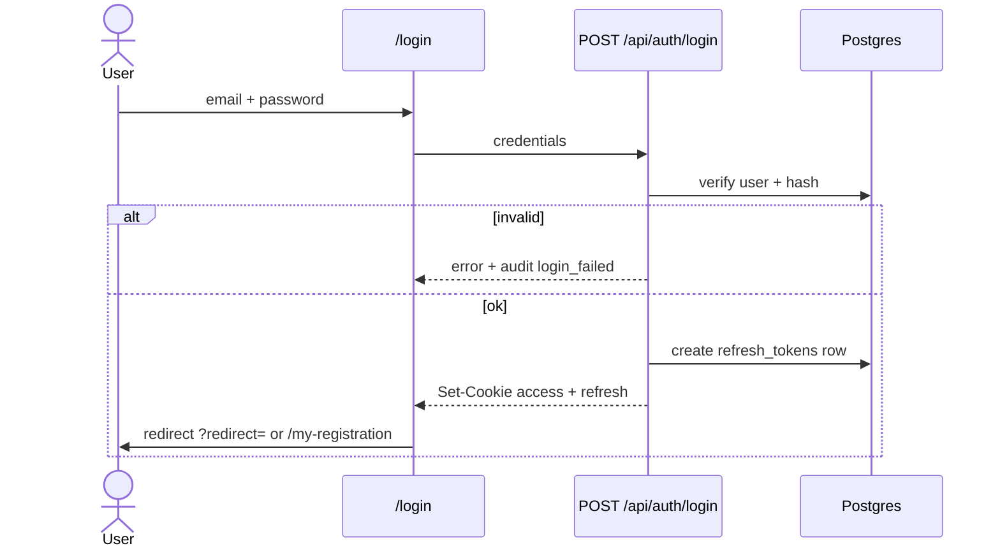
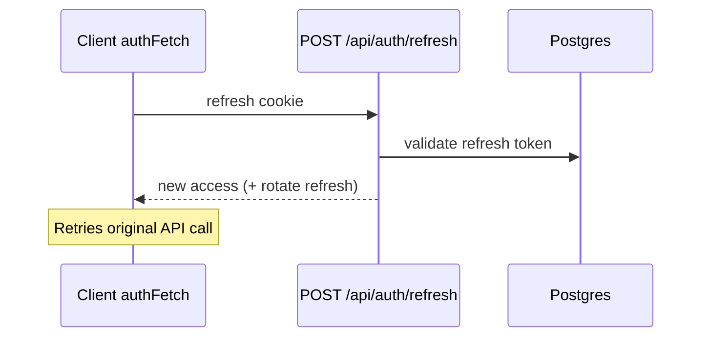
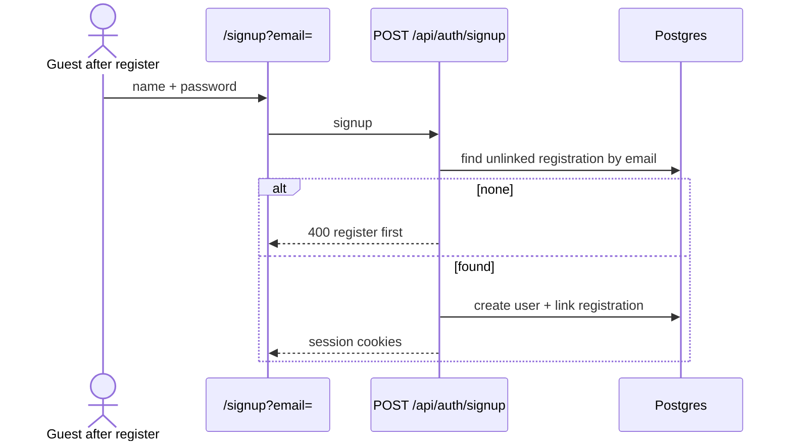

# Auth flows

Specs: `global.auth-security`, `features.login`, `features.signup`, `features.password-reset`, `features.account`.

## Roles

```mermaid
flowchart TB
  subgraph Groups
    admin[admin]
    rm[registration_manager]
    am[accommodation_manager]
    p[participant]
  end
  Managers[isManager]
  admin --> Managers
  rm --> Managers
  am --> Managers
  p --> ParticipantUX[My registration / Payment]
  Managers --> Dashboard[/dashboard]
```

## Login sequence



## Access token refresh



## Account setup (post-registration only)

Cold `/signup` without linking context is blocked in UI; API requires an **unlinked registration** for the email (no draft-for-strangers).



## Middleware gate

Protected prefixes: `/my-registration`, `/payment`, `/dashboard`, `/account`.

Unauthenticated → `/login?redirect=<path>`.

## Debug tips

- 401 on API after login → check cookies + `JWT_SECRET` mismatch between processes
- Redirect loop → `paths.ts` / middleware matcher vs public routes
- Audit: `auth.login`, `auth.login_failed`, `auth.logout`, `auth.signup`
