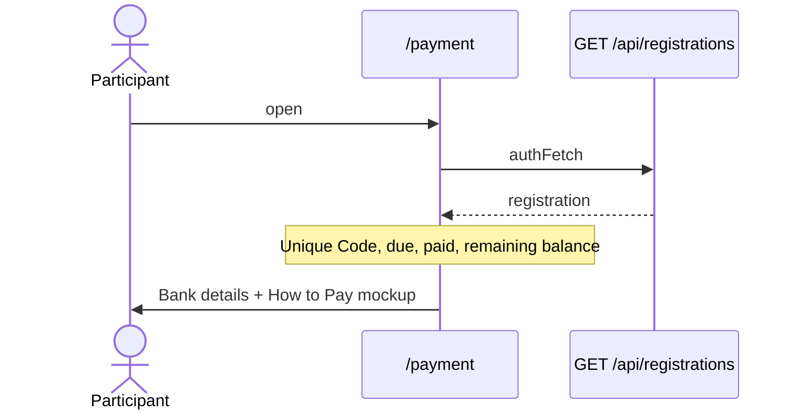
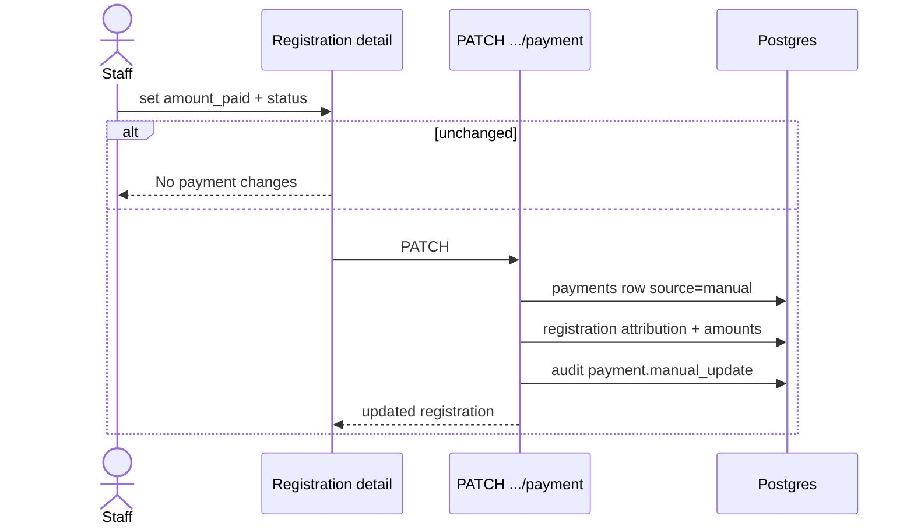
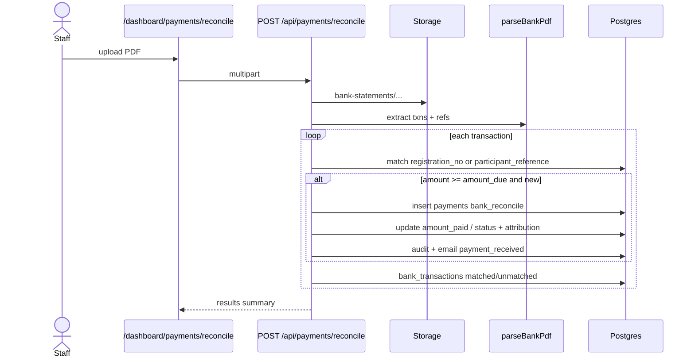

# Payment & reconcile flows

Specs: `features.payment`, `features.dashboard` (reconcile + admin payment).

## Participant payment info

Participant pays **outside** the app via bank transfer using the Unique Code in Message and Ref.

## Admin manual payment update

Attribution fields: `payment_last_updated_source` (`manual` | `bank_reconcile`), `payment_last_updated_at`, `payment_last_updated_by`.

## Bank PDF reconcile

## Debug tips

- Payment not matched → Unique Code vs registration_no in statement text; amount threshold
- Remaining balance = `max(0, amount_due - amount_paid)`
- Permission: `payments:reconcile` for reconcile + typically `registrations:write_all` for manual updates
