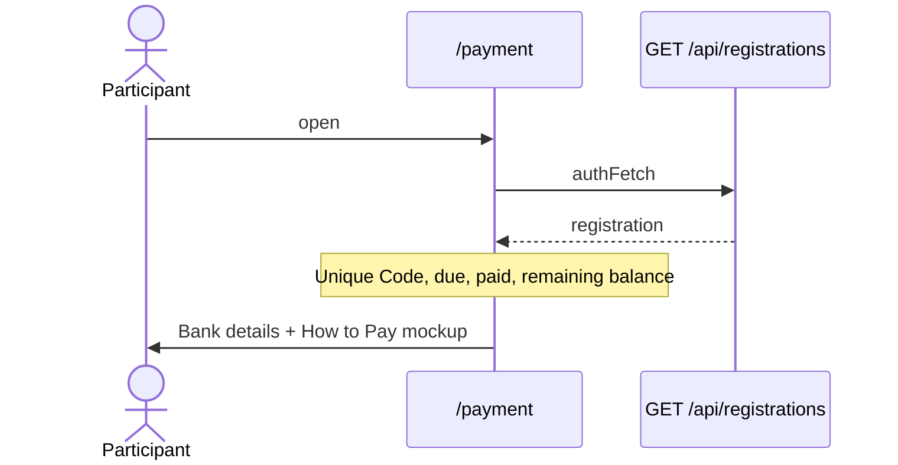
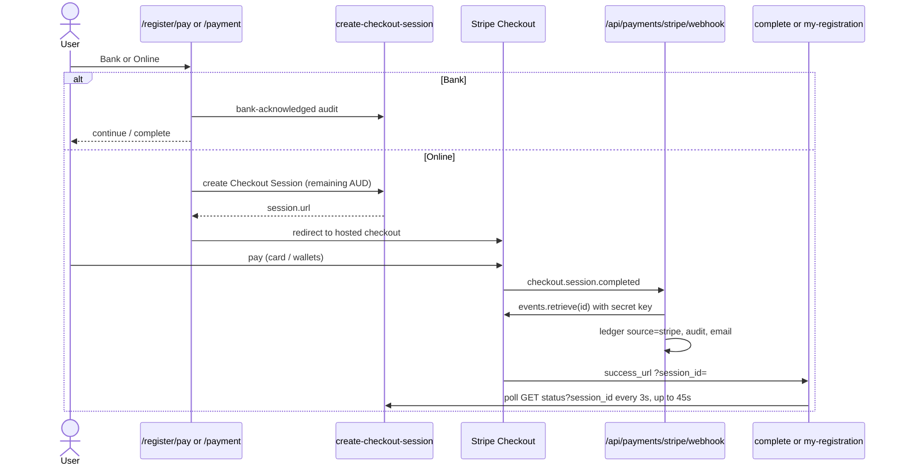
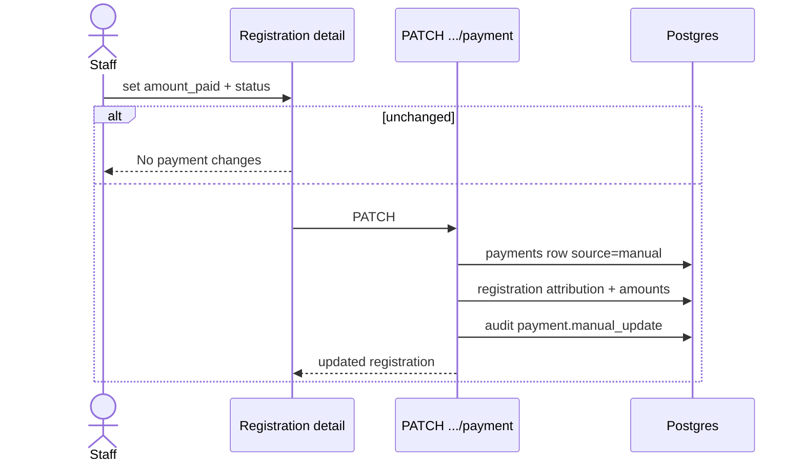
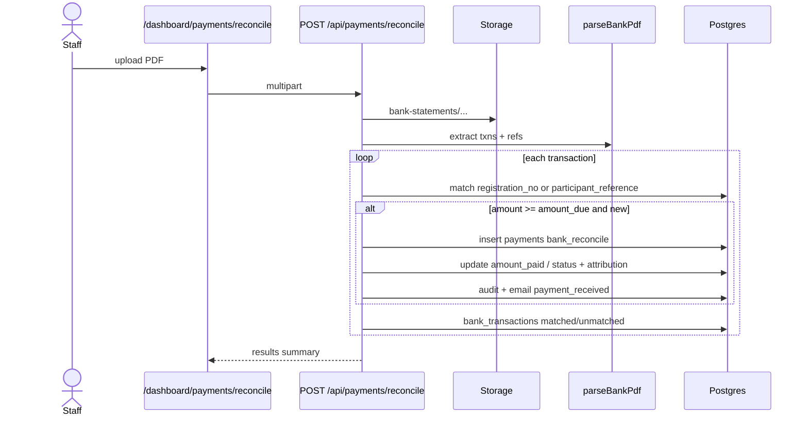

# Payment & reconcile flows

Specs: `features.payment`, `features.registration-workflow-v2`, `features.dashboard` (reconcile + admin payment).

## Workflow modes

Dashboard → Registration Settings → **Registration payment workflow**:

| Mode | Participant path |
|------|------------------|
| **V1 (default)** | Submit → complete → bank via `/payment` |
| **V2** | Proceed to Payment → `/register/pay` (Bank + Online if Stripe keys) → complete |

Resolution: env `REGISTRATION_WORKFLOW` (optional emergency override) → DB setting → `v1`.

Sign-off: leave V1 until tested → set V2 in Settings → rollback by setting V1 again.

## Participant payment info (V1)

```mermaid
sequenceDiagram
  actor P as Participant
  participant Pay as /payment
  participant API as GET /api/registrations
  P->>Pay: open
  Pay->>API: authFetch
  API-->>Pay: registration
  Note over Pay: Unique Code, due, paid, remaining balance
  Pay->>P: Bank details + How to Pay mockup
```

Participant pays **outside** the app via bank transfer using the Unique Code in Message and Ref.

## V2 pay step + Stripe

```mermaid
sequenceDiagram
  actor U as User
  participant Pay as /register/pay or /payment
  participant API as create-checkout-session
  participant Stripe as Stripe Checkout
  participant WH as /api/payments/stripe/webhook
  participant Done as complete or my-registration
  U->>Pay: Bank or Online
  alt Bank
    Pay->>API: bank-acknowledged audit
    Pay-->>U: continue / complete
  else Online
    Pay->>API: create Checkout Session (remaining AUD)
    API-->>Pay: session.url
    Pay->>Stripe: redirect to hosted checkout
    U->>Stripe: pay (card / wallets)
    Stripe->>WH: checkout.session.completed
    WH->>Stripe: events.retrieve(id) with secret key
    WH->>WH: ledger source=stripe, audit, email
    Stripe->>Done: success_url ?session_id=
    Done->>API: poll GET status?session_id every 3s, up to 45s
  end
```

Outcome handling (see `features.registration-workflow-v2` for participant copy):

- **Succeeded** — ledger applied once (by PaymentIntent id), receipt email sent.
- **Processing** — delayed payment method; `async_payment_succeeded` / `async_payment_failed` settle it later.
- **Failed / expired** — audit only; no ledger change. Return page links back to the pay step.
- **Cancelled** — Stripe `cancel_url` returns to the pay step with `payment=cancelled`.
- **Timeout** — client stops polling after 45s and tells the participant not to pay again; the webhook still completes the ledger.

Each Pay click sends a fresh `attemptId`, used as the Stripe idempotency key, so a retry after cancel or expiry always gets a new session.

Only `STRIPE_SECRET_KEY` is required. The webhook ignores the posted payload beyond the event id and re-fetches the event from Stripe, so no signing secret is used. Online section is hidden when the secret key is unset. Amounts always come from `amount_due - amount_paid` on the server.

## Daily payment reminders and early-bird expiry

The authorized payment-reminder cron runs daily. It first reprices submitted, unpaid or partially paid early-bird registrations to regular pricing when the configured early-bird payment due date has passed. It then sends reminder emails only when today is one of the configured reminder dates. Repricing clears the early-bird marker, making reruns idempotent; paid registrations are not changed.

## Admin manual payment update

```mermaid
sequenceDiagram
  actor S as Staff
  participant UI as Registration detail
  participant API as PATCH .../payment
  participant DB as Postgres
  S->>UI: set amount_paid + status
  alt unchanged
    UI-->>S: No payment changes
  else
    UI->>API: PATCH
    API->>DB: payments row source=manual
    API->>DB: registration attribution + amounts
    API->>DB: audit payment.manual_update
    API-->>UI: updated registration
  end
```

Attribution fields: `payment_last_updated_source` (`manual` | `bank_reconcile` | `stripe`), `payment_last_updated_at`, `payment_last_updated_by`.

Admin detail shows the payment ledger (including Stripe PaymentIntent ids when present).

## Bank PDF reconcile

```mermaid
sequenceDiagram
  actor S as Staff
  participant UI as /dashboard/payments/reconcile
  participant API as POST /api/payments/reconcile
  participant Store as Storage
  participant Parse as parseBankPdf
  participant DB as Postgres
  S->>UI: upload PDF
  UI->>API: multipart
  API->>Store: bank-statements/...
  API->>Parse: extract txns + refs
  loop each transaction
    API->>DB: match registration_no or participant_reference
    alt amount >= amount_due and new
      API->>DB: insert payments bank_reconcile
      API->>DB: update amount_paid / status + attribution
      API->>DB: audit + email payment_received
    end
    API->>DB: bank_transactions matched/unmatched
  end
  API-->>UI: results summary
```

## Debug tips

- Payment not matched → Unique Code vs registration_no in statement text; amount threshold
- Remaining balance = `max(0, amount_due - amount_paid)`
- Stripe Online missing → check `STRIPE_SECRET_KEY` and workflow = V2
- Paid on Stripe but not marked paid → check webhook endpoint URL + `checkout.session.completed` delivery in Stripe Dashboard
- Permission: `payments:reconcile` for reconcile + typically `registrations:write_all` for manual updates
