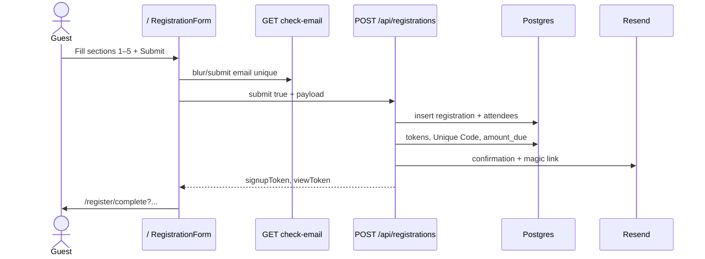
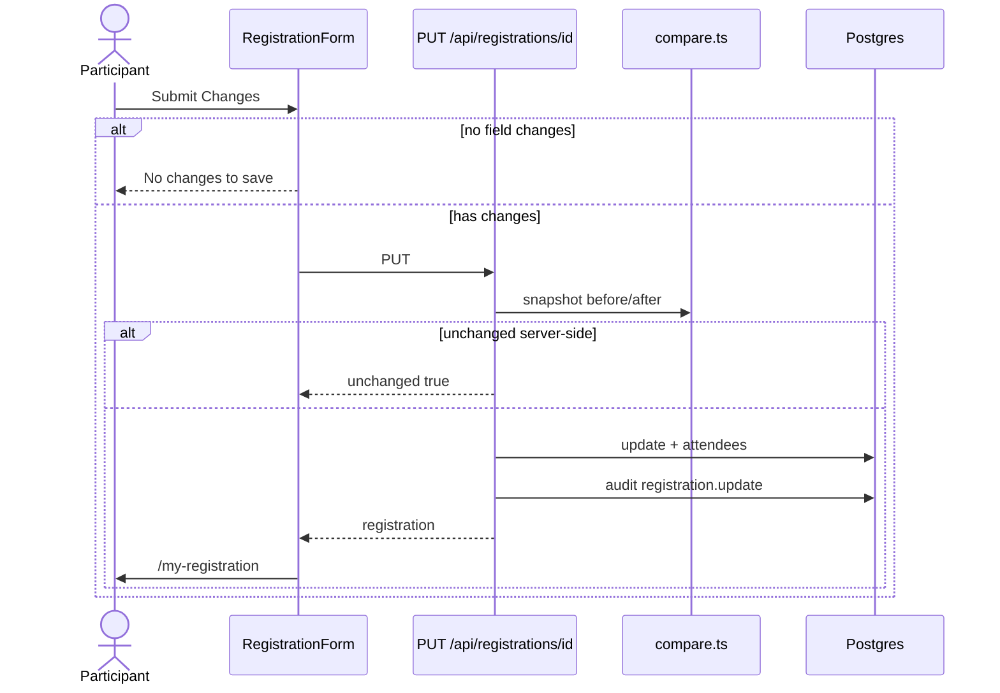
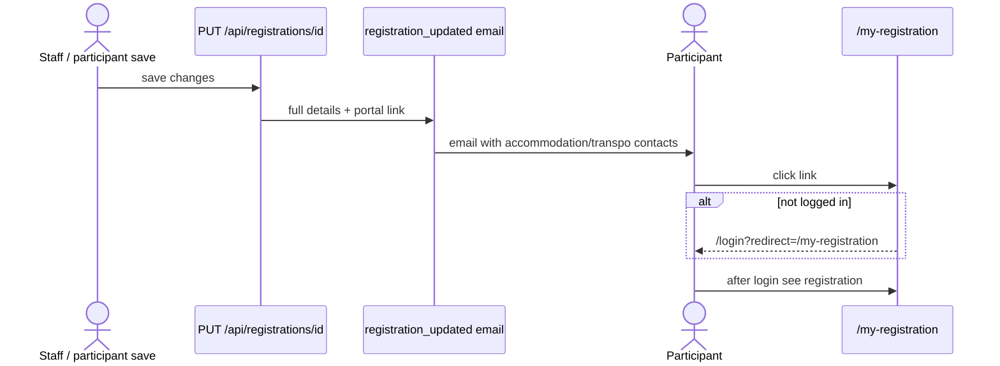
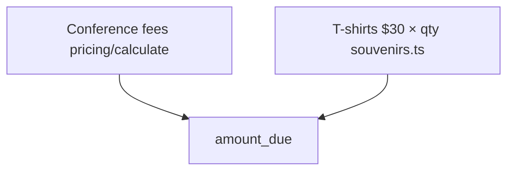

# Registration flows

Specs: `features.registration`, `features.registration-complete`, `features.magic-link-view`, `features.home`.

## Continuous form (guest)



## Logged-in update



## Magic link view

```mermaid
flowchart LR
  Email[Confirmation email] -->|/r/token| View[Read-only page]
  View -->|Edit| LoginOrSignup{Has account?}
  LoginOrSignup -->|yes| Login[/login]
  LoginOrSignup -->|no| Signup[/signup?email=]
```

## Update notification email



## Amount due composition



## Key files

| Concern | Path |
|---------|------|
| UI | `src/components/registrations/registration-form.tsx` |
| Zod | `src/lib/registrations/schema.ts` |
| Persist | `src/lib/registrations/service.ts` |
| No-op detect | `src/lib/registrations/compare.ts` |
| Public/auth POST | `src/app/api/registrations/route.ts` |

## Debug tips

- Email already used → `EMAIL_IN_USE` + Login link
- Amount wrong → check early bird slot + souvenir_orders JSON
- Empty audits → ensure no-op path; see compare + PUT early return
