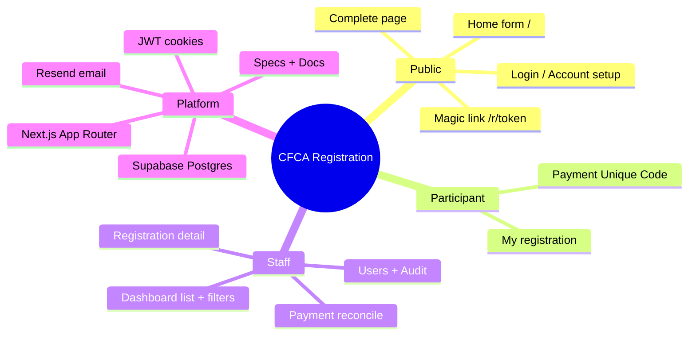

# Welcome to CFCA Registration

## What this product does

Public conference **registration**, optional **Love In Action t-shirt** pre-orders, **bank-transfer payment** with a Unique Code, and a **staff dashboard** (list, filters, payment reconcile, users, audit).

Primary entry for guests: **`/`** (registration form). Staff: **`/dashboard`**.

## Glossary

| Term | Meaning |
|------|---------|
| **Unique Code** | `participant_reference` — put in bank Message + Ref |
| **Registration No** | Human-facing `registration_no` (e.g. `CFCA26-000004`) |
| **Manager** | User in `admin`, `registration_manager`, or `accommodation_manager` |
| **Spec** | Product behavior doc under `specs/` |
| **Handbook** | This engineering docs set under `docs/` |
| **Souvenir orders** | JSON `souvenir_orders` — t-shirt size/qty @ $30 |

## Mental model (mind map)

## First day (30–60 minutes)

1. Read [../architecture/overview.md](../architecture/overview.md).
2. Skim [../specs/INDEX.md](../../specs/INDEX.md) (product map).
3. Run locally: [../operations/local-dev.md](../operations/local-dev.md).
4. Click through as guest: register → complete → login path.
5. Login as admin (seeded via deploy) → dashboard.

## Where truth lives

- **“Should the form require transport?”** → `specs/features/registration.md`
- **“Which file owns the form?”** → that spec’s `files:` list + [../architecture/folder-map.md](../architecture/folder-map.md)
- **“How does login set cookies?”** → [../flows/auth.md](../flows/auth.md)

## Next

Continue with [02-first-week.md](./02-first-week.md).
