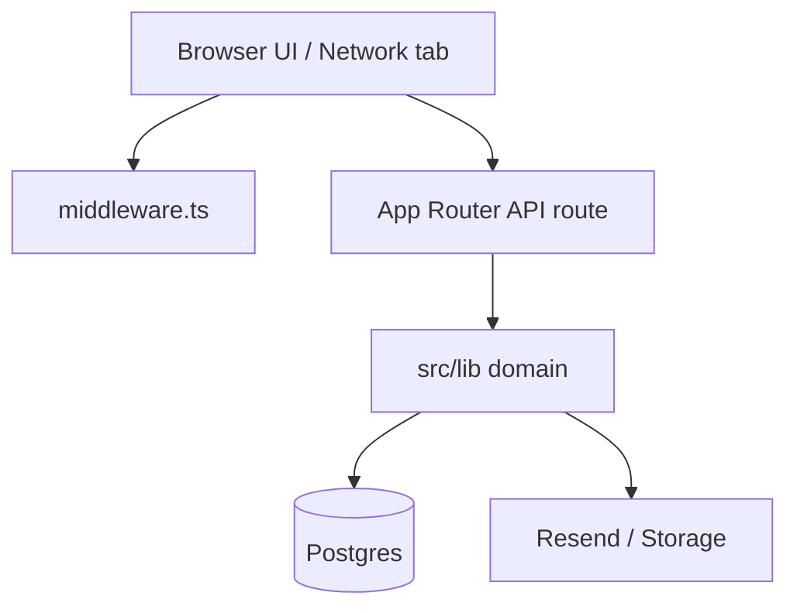

# Debugging playbook

Use this when something “should work” but doesn’t. Prefer **reproduce → locate layer → fix → verify** ([fix-a-bug](../contributing/fix-a-bug.md)).

## Layer map

Ask: Is it **UI state**, **auth/middleware**, **API validation**, **DB data**, or **external** (email/PDF)?

## Quick triage table

| Symptom | Likely layer | First checks |
|---------|--------------|--------------|
| Redirect to login unexpectedly | Middleware / cookies | `paths.ts`, cookie names `cfca_access_token` / `cfca_refresh_token`, JWT secrets |
| 401 on API after login | Auth refresh | `authFetch`, `/api/auth/refresh`, refresh_tokens row |
| Form won’t submit | Zod / client | Network payload vs `schema.ts`; console errors |
| Email already used | DB uniqueness | `009_unique_registration_email.sql`; check-email API |
| Wrong amount due | Pricing + souvenirs | `pricing/calculate.ts`, `souvenirs.ts`, `amount_due` column |
| Payment not matched | Reconcile parse | Unique Code in PDF text; amount ≥ due; `bank_transactions` |
| Dashboard empty / stale | Cache / permissions | Refresh button; group membership; GET `/api/registrations` status |
| Edit saves but no audit | No-op guard | `compare.ts`; “No changes to save” |
| Emails missing | Resend / env | `RESEND_API_KEY`, `EMAIL_FROM`; server logs |
| Schema error on insert | Migration drift | `npm run db:deploy`; missing column vs code |

## Auth debugging

1. Confirm cookies present (Application → Cookies) after login.
2. Decode access JWT expiry (do not paste secrets into chat logs carelessly).
3. Hit a protected page: middleware should redirect with `?redirect=`.
4. Check audit: `auth.login` / `auth.login_failed`.

Sequence reference: [flows/auth.md](../flows/auth.md).

## Registration debugging

1. Capture failed request body from Network tab.
2. Compare to Zod schema fields (dates as ISO strings, attendees array, souvenir_orders).
3. Server logs from `POST /api/registrations` / `PUT .../[id]`.
4. Inspect row in `registrations` + `registration_attendees`.

Sequence reference: [flows/registration.md](../flows/registration.md).

## Payment / reconcile debugging

1. Confirm Unique Code on registration (`participant_reference`).
2. Open reconcile result: matched vs unmatched transactions.
3. Check `payments.source` (`manual` vs `bank_reconcile`) and attribution columns.
4. Remaining balance UI: `max(0, amount_due - amount_paid)`.

Sequence reference: [flows/payment.md](../flows/payment.md).

## Dashboard debugging

1. Hard **Refresh** to bypass client cache.
2. Filters apply to full cached set — clear filters if list looks empty.
3. Permission denied → user’s groups/permissions in admin users UI.

## Logging & audit

- Prefer **audit_log** for “who changed what” on mutations.
- Do not log passwords, raw tokens, or full JWTs.

## Production vs local

- Local `dev` = latest source; `start` = last **build**.
- Env mismatch (different `JWT_*` or Supabase project) looks like “random” auth failures.

## Escalation info for seniors

When asking for help, include: environment (dev/prod), exact URL, HTTP status, request id/time, whether guest or role, and whether a recent migration ran.
