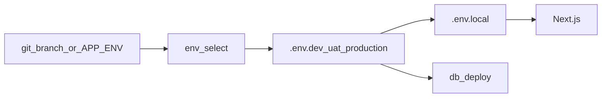

# Environments (DEV / UAT / Production)

Each git branch uses its **own** secrets and its **own** Supabase project. Never point a DEV or UAT app at the production database.

## Branch → env map

| Git branch | `APP_ENV` | Local file | Vercel |
|------------|-----------|------------|--------|
| `dev` | `dev` | `.env.dev` | Preview → branch `dev` |
| `uat` | `uat` | `.env.uat` | Preview → branch `uat` |
| `master` or `main` | `production` | `.env.production` | Production |

Override locally: `npm run env:select -- --env=uat` or `npm run dev:uat` (does not require checking out the branch).



## Local setup

1. Copy templates (once per machine):

```bash
cp .env.dev.example .env.dev
cp .env.uat.example .env.uat
cp .env.production.example .env.production
```

2. Fill each file with that environment’s Supabase URL/keys, JWT secrets, Resend, bank details, etc.
3. Check out a branch (`dev` / `uat` / `master`) and run `npm run dev` — `env:select` runs first and writes `.env.local`.

| Script | Purpose |
|--------|---------|
| `npm run env:select` | Sync `.env.local` from the branch (or `--env=`) |
| `npm run dev` | Select env → migrate → Next.js |
| `npm run dev:dev` / `dev:uat` / `dev:production` | Force an env without changing branch |
| `npm run db:deploy` | Select env → apply migrations to **that** Supabase project |

Secrets stay gitignored (`.env*`). Only `.env*.example` is committed.

## Vercel setup

In **Project → Settings → Environment Variables**:

1. **Production** — all production keys + `APP_ENV=production` (deployed from `master`).
2. **Preview**, limited to branch **`dev`** — DEV Supabase + secrets + `APP_ENV=dev`.
3. **Preview**, limited to branch **`uat`** — UAT Supabase + secrets + `APP_ENV=uat`.

Also recommended:

- `SKIP_DB_DEPLOY=true` on Vercel if you apply migrations from your machine / CI against each Supabase project separately.
- Enable Preview deployments for `dev` and `uat`.
- Prefer **one** migration deployer per Supabase project (app `db:deploy` **or** Supabase Git migrations — not both). See [migrations.md](./migrations.md).

## Safety rules

- Separate Supabase projects for `dev`, `uat`, and `production`.
- Unique `JWT_ACCESS_SECRET` / `JWT_REFRESH_SECRET` / `CRON_SECRET` per env.
- Distinct `REGISTRATION_CODE_PREFIX` on non-prod (e.g. `CFCA26-DEV`) so codes are obvious in testing.
- After filling a new `.env.*`, run `npm run env:select` (or restart `npm run dev`) so `.env.local` refreshes.

## Related

- [Local development](./local-dev.md)
- [Migrations](./migrations.md)
- [Tech stack](../architecture/tech-stack.md)
