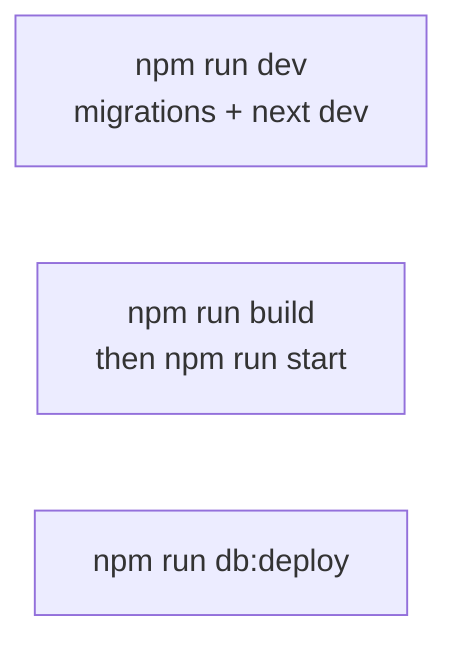

# Local development

## Prerequisites

- Node.js 20+ (match team version if pinned)
- npm
- Supabase project + access (URL, publishable key, service role, access token for migrations)

## Setup

```bash
npm install
cp .env.example .env
# Fill JWT secrets, Supabase keys, SEED_ADMIN_*, bank details, optional Resend
```

Required for a useful local run:

| Variable | Why |
|----------|-----|
| `NEXT_PUBLIC_SUPABASE_URL` | DB + storage |
| `SUPABASE_SERVICE_ROLE_KEY` | Server DB writes (must be the project **secret** / `service_role` key from Dashboard → API Keys — a stale key returns `Invalid API key`) |
| `SUPABASE_ACCESS_TOKEN` | `npm run db:deploy` |
| `JWT_ACCESS_SECRET` / `JWT_REFRESH_SECRET` | Auth cookies |
| `SEED_ADMIN_EMAIL` / `SEED_ADMIN_PASSWORD` | First staff login |

Email magic links use the request Host / `X-Forwarded-*` headers automatically (no `NEXT_PUBLIC_SITE_URL`).

## Run modes



| Command | Use when |
|---------|----------|
| `npm run dev` | Day-to-day coding (HMR) |
| `npm run build` + `npm run start` | Verify production bundle |
| `npm run db:deploy` | Apply migrations without starting Next |

> **`start` serves the last build.** After source edits, rebuild before `start`, or use `dev`.

## Restart after code change

If a long-running `dev` / `start` process is already up and behavior looks stale:

1. Stop the process (Ctrl+C in that terminal).
2. Restart `npm run dev` (or rebuild + `start`).
3. Confirm startup logs show migration runner + Next ready.

## Smoke checklist

1. Open `/` — registration form loads.
2. Submit a test registration (unique email).
3. `/register/complete` shows Unique Code path.
4. Create account via signup linking that email (post-registration only).
5. `/my-registration` and `/payment` work when logged in.
6. Login as seed admin → `/dashboard` lists registrations.

## Skip migrations

Set `SKIP_DB_DEPLOY=true` (e.g. CI) when the DB is managed elsewhere.

## Next

- [Debugging](./debugging.md)
- [Migrations](./migrations.md)
- [First week](../onboarding/02-first-week.md)
