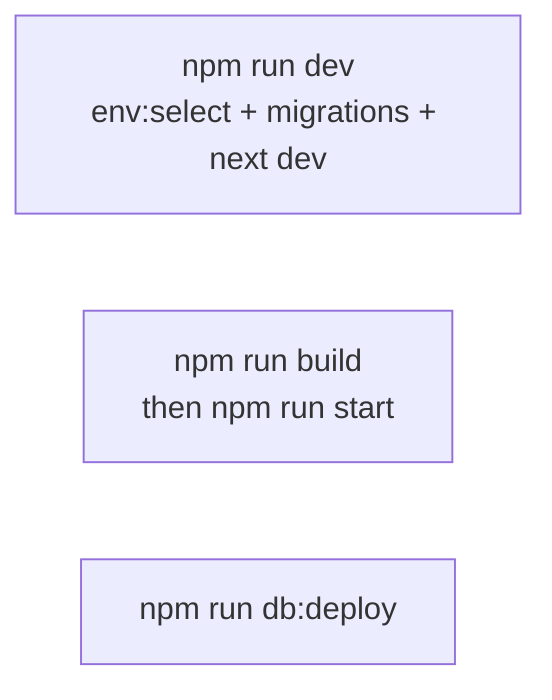

# Local development

## Prerequisites

- Node.js 20+ (match team version if pinned)
- npm
- **Three** Supabase projects (DEV / UAT / Production) with URL, publishable key, service role, and access token for migrations

## Setup

```bash
npm install

# One file per environment (gitignored) — start from committed templates
cp .env.dev.example .env.dev
cp .env.uat.example .env.uat
cp .env.production.example .env.production
# Fill each with that env’s Supabase + JWT + email + bank secrets
```

Checkout the branch you want (`dev`, `uat`, or `master`). `npm run dev` runs `env:select` so `.env.local` matches that branch. Details: [environments.md](./environments.md).

Required in each `.env.<env>` for a useful run:

| Variable | Why |
|----------|-----|
| `NEXT_PUBLIC_SUPABASE_URL` | DB + storage for **that** env’s project |
| `SUPABASE_SERVICE_ROLE_KEY` | Server DB writes (Dashboard → API Keys → **secret** / service_role) |
| `SUPABASE_ACCESS_TOKEN` | `npm run db:deploy` |
| `JWT_ACCESS_SECRET` / `JWT_REFRESH_SECRET` | Auth cookies (unique per env) |
| `SEED_ADMIN_EMAIL` / `SEED_ADMIN_PASSWORD` | First staff login |

Email magic links use the request Host / `X-Forwarded-*` headers automatically (no `NEXT_PUBLIC_SITE_URL`).

## Run modes



| Command | Use when |
|---------|----------|
| `npm run env:select` | Refresh `.env.local` from branch / `--env=` |
| `npm run dev` | Day-to-day coding (HMR) for current branch’s env |
| `npm run dev:dev` / `dev:uat` / `dev:production` | Force an env without changing git branch |
| `npm run build` + `npm run start` | Verify production bundle |
| `npm run db:deploy` | Apply migrations to the **selected** Supabase project |

> **`start` serves the last build.** After source edits, rebuild before `start`, or use `dev`.

## Restart after code change

If a long-running `dev` / `start` process is already up and behavior looks stale:

1. Stop the process (Ctrl+C in that terminal).
2. Restart `npm run dev` (or rebuild + `start`).
3. Confirm startup logs show `[env] Selected APP_ENV=…`, migration runner, and Next ready.

## Smoke checklist

1. Open `/` — registration form loads.
2. Submit a test registration (unique email).
3. `/register/complete` shows Unique Code path.
4. Create account via signup linking that email (post-registration only).
5. `/my-registration` and `/payment` work when logged in.
6. Login as seed admin → `/dashboard` lists registrations.

## Skip migrations

Set `SKIP_DB_DEPLOY=true` (e.g. on Vercel) when the DB is managed elsewhere.

## Next

- [Environments (DEV / UAT / Production)](./environments.md)
- [Debugging](./debugging.md)
- [Migrations](./migrations.md)
- [First week](../onboarding/02-first-week.md)
