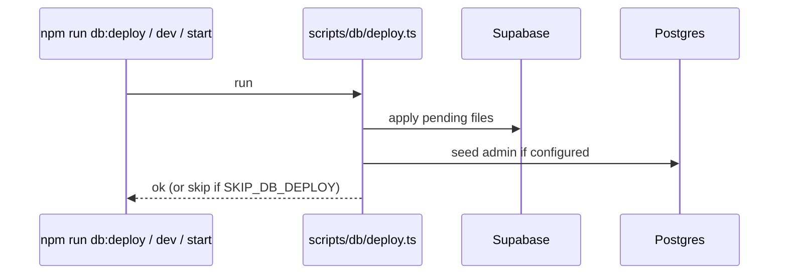

# Database migrations

Spec: `global.database`. Migrations live only in `supabase/migrations/` as numbered SQL files.

## How deploy works

`dev` and `start` prefix with the same deploy script so local/prod-like runs stay schema-aligned.

## Adding a migration

1. Create `supabase/migrations/0NN_short_name.sql` (next number after highest existing).
2. Prefer additive changes (`ALTER TABLE … ADD COLUMN`, new indexes). Avoid destructive drops without a plan.
3. Update `specs/global/database.md` (and feature specs if behavior depends on the column).
4. Update [data/model.md](../data/model.md) if entities/relationships change.
5. Update Zod / mappers / compare snapshots / APIs that read-write the field.
6. Run `npm run db:deploy` (or restart `dev`) and verify.

## Current migration series (reference)

| File | Theme |
|------|-------|
| `000_migration_runner.sql` | Runner bookkeeping |
| `001_auth.sql` | Users, groups, permissions, refresh tokens |
| `002_registrations.sql` | Registrations + attendees |
| `003_payments.sql` | Payments + bank tables |
| `004_storage.sql` | Storage buckets |
| `005_rls_grants.sql` | Historical open grants (superseded by `013`) |
| `006_participant_reference.sql` | Unique Code |
| `007_password_reset_and_audit.sql` | Reset + audit_log |
| `008_public_registration.sql` | Guest registration support |
| `009_unique_registration_email.sql` | Unique email |
| `010_transport_contacts.sql` | Pickup/dropoff contacts |
| `011_payment_attribution_and_notes.sql` | Attribution + admin notes |
| `012_souvenir_orders.sql` | `souvenir_orders` JSONB |
| `013_enable_rls_revoke_anon.sql` | Enable RLS; revoke anon/authenticated Data API grants |

Re-check the folder when onboarding — this table can lag; **filesystem is authoritative**.

## Rules

- **Never** edit an already-applied migration on a shared database; add a new file.
- Keep SQL idempotent where practical (`IF NOT EXISTS`).
- Document enums / check constraints in the SQL file comments if non-obvious.
- **Always enable RLS** on new `public` tables. Do not grant `anon` / `authenticated` table access. App DB access goes through the server **service role** client.

## Rollback mindset

There is no automatic down-migration. For production mistakes:

1. Forward-fix with a new migration when safe.
2. Coordinate data repair scripts carefully (prefer one-off reviewed SQL).

## Debug tips

- Column missing in runtime → migration not applied or wrong project URL.
- Permission denied / empty results after RLS harden → confirm `SUPABASE_SERVICE_ROLE_KEY` is set and `admin.ts` uses service role (not publishable/anon).
- `rls_disabled_in_public` advisor alert → a new table was created without `ENABLE ROW LEVEL SECURITY`.
